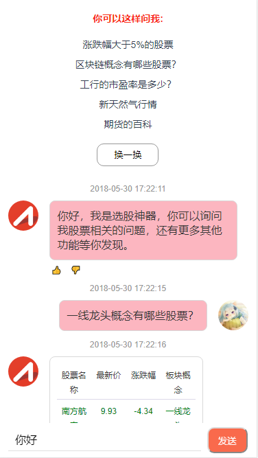
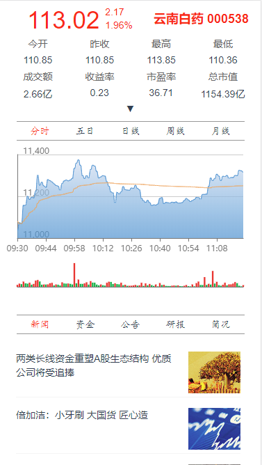
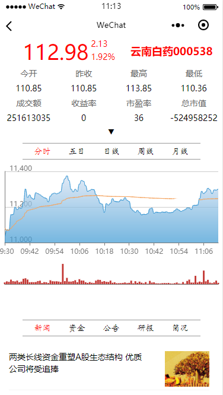
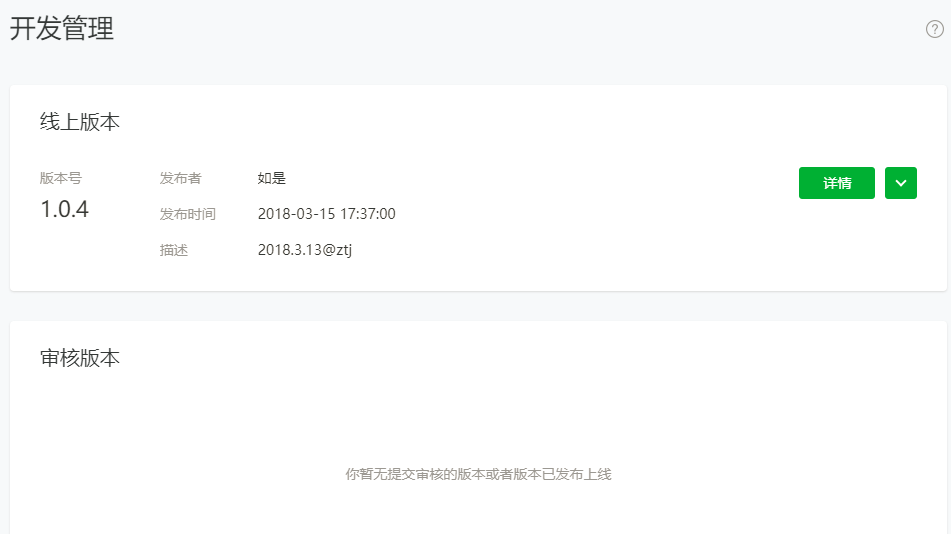
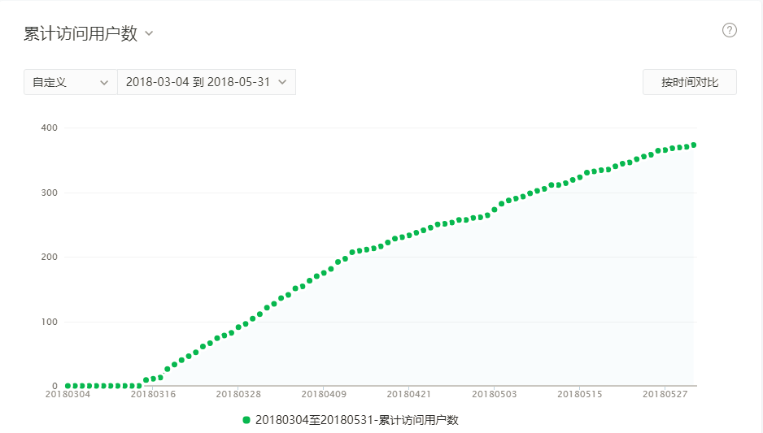

<!-- <p align="center"></a></p>
<p align="center">
   <a href="https://circleci.com/gh/vuejs/vue/tree/dev"></a>
   <a href="https://www.npmjs.com/package/vue"></a>
   <a href="https://www.npmjs.com/package/vue"></a>
</p> -->
# 选股机器人（移动端/小程序）

**A Vue + Mpvue Project**

一体化移动端与小程序开发，实现全套代码复用。

> [Vue](https://cn.vuejs.org/) 是一套用于构建用户界面的渐进式框架。`Vue` 的核心库只关注视图层，不仅易于上手，还便于与第三方库或既有项目整合。另一方面，当与现代化的工具链以及各种支持类库结合使用时，`Vue` 也完全能够为复杂的单页应用提供驱动。

> [mpvue](http://mpvue.com/) 是一个使用 `Vue.js` 开发小程序的前端框架。框架基于 `Vue.js` 核心，`mpvue` 修改了 `Vue.js` 的 runtime 和 compiler 实现，使其可以运行在小程序环境中，从而为小程序开发引入了整套 `Vue.js` 开发体验。

## Build Setup

``` bash
# install dependencies
npm install

# build mini program
npm run dev

# build H5 page
npm run devH5

# build for production with minification for mini program
npm run build

# build for production with minification for H5 page
npm run buildH5

# build for production and view the bundle analyzer report
npm run build --report
```

## 主要特性

* 使用 `Vue.js` 构建移动端应用
* 使用 `mpvue` 复用代码构建小程序应用
* 组件化开发，提高代码复用性
* 使用 Vuex 数据管理方案，方便构建复杂应用
* 使用 webpack 构建机制：自定义构建策略、开发阶段 hotReload
* 支持使用 npm 外部依赖

## 截图

### 移动端

 

### 微信端

 

## 上线

### 移动端在线demo地址

[选股机器人](http://47.97.183.104:85)

### 小程序按照微信流程发布





## Contribution

[RuShi](https://github.com/zz570557024)

## License

[MIT](http://opensource.org/licenses/MIT)

## P.S.
- *此项目适合Vue框架，mpvue框架和多端开发学习，对于公司大型项目不建议一体化开发；*
- *这个版本直接构建小程序会有一些报错，需要将报错插件移除；*
- *部分样式无法统一，需要调整；*
- *毕竟老板要哪个，打个包丢给他，要两个端同时开发而且表现一模一样，需要把张小龙抓起来问他干嘛自己造个轮子~*
